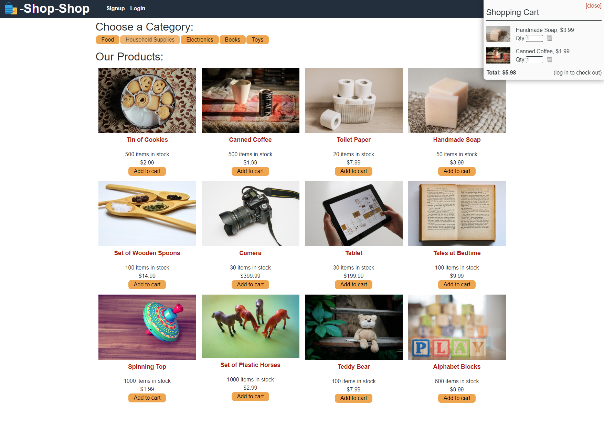
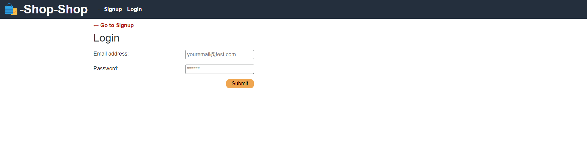
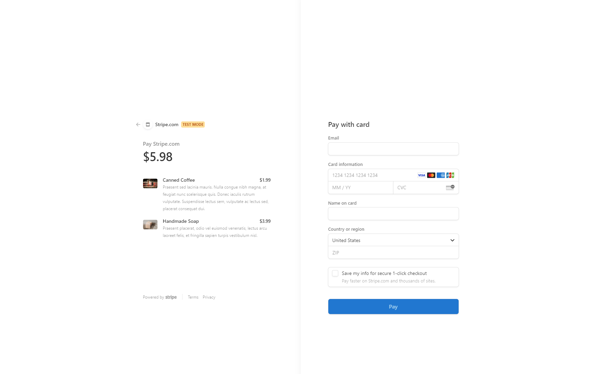

# Jeremy Colegroves Shopping Cart

## Description
Hey there! This is the repository for a training challenge.

The goal was turn the state from using React Context API to Redux.

The website is currently being hosted on Heroku, and you can view it by [clicking here](https://shopping-cart-2u.herokuapp.com/).

## Screenshots

